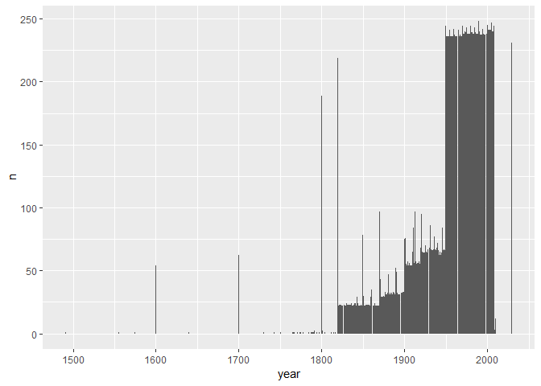
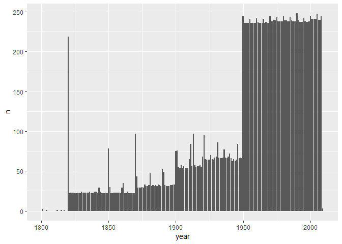
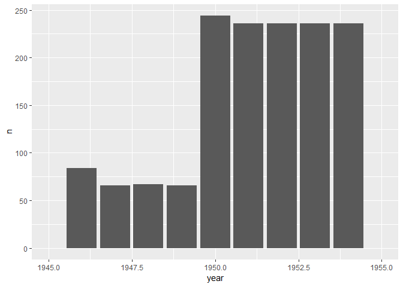
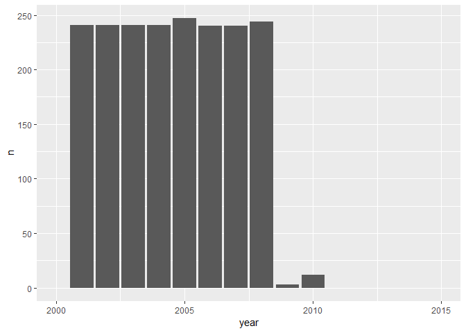
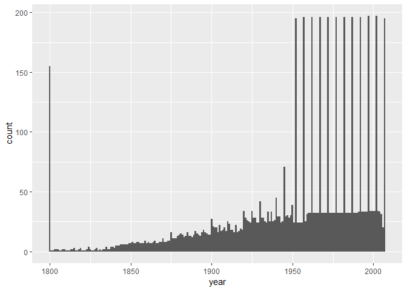
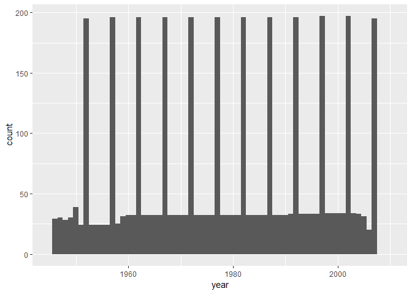
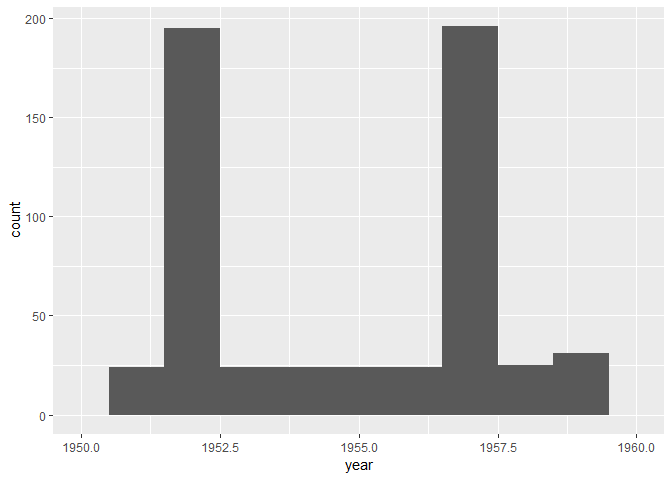
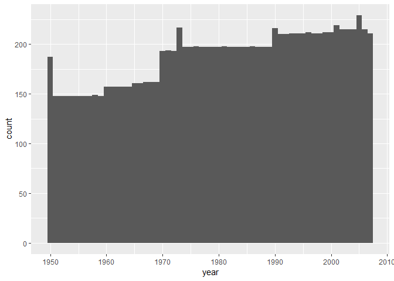

Introduction to data cleaning in R (the tidyverse way)
================

This is an opionated introduction to importing and cleaning your data
specifically focused on tools from the
[tidyverse](https://www.tidyverse.org/). A really good resource for
learning R at your own speed is [R for data
science](https://r4ds.had.co.nz/), by Hadley Wickham and Garrett
Grolemund.

We’ll also go briefly go over reading in excel files, as that is a
common format in many fields (CSV is more common in scientific fields,
although a “CSV” is not a uniformly formatted file, as we shall see).

tidyverse is a meta library that bundles several libraries together, for
our purposes we will be using functions from the readr (fast, C++ based
import functions) library and dplyr for cleaning. Technically there is
one final library called magrittr used that gives us what is called a
“pipe” that glues together multiple commands.

IMPORTANT\! How to keep all of your files/Rstudio pointing to a place of
your choosing. R/Rstudio will look for files in the place where it is
started from (or its HOME). Often this will be Documents in windows or
something similar on
linux.

[Projects](https://support.rstudio.com/hc/en-us/articles/200526207-Using-Projects)
are Rstudios way of associating a new/existing directory with R files. I
recommend you create a project for this workshop (name it whatever you
like). Once you create this project, rstudio will automatically change
the internal path to that directory. You can manually get and change
directories with getwd() and setwd(), but that tends to be brittle
(directories don’t exist on other people’s computers or in different
years even on the same person’s computer), so project’s tend to be a
little more general and user friendly. For more details and an example
of using an extra package called here that lets you references
directories relative to the base project [see this blog post by Jenny
Bryan](https://www.tidyverse.org/articles/2017/12/workflow-vs-script/)
It’s somewhat advanced and more about production code (i.e. if you are
going to share with others vs code just intended for yourself)

Copy this Rmd and the supporting data files
(gapdata.xls,gdpPercap.txt,life,life-expectancy-reference-spreadsheet-20090204-xls-format.xls)
to the project directory you created.

PART I

``` r
#remove the # to uncomment the following lines
#before install.packages and run these commands if they are not installed on your system
#install.packages('tidyverse') #do this if you have not installed before
#install.packages('summarytools')
#install.packages('readxl')
#install.packages('gapminder')
library(gapminder)
library(tidyverse) 
```

    ## -- Attaching packages --------------------------------------------------------------------------------------------- tidyverse 1.2.1 --

    ## v ggplot2 3.0.0     v purrr   0.2.5
    ## v tibble  1.4.2     v dplyr   0.7.6
    ## v tidyr   0.8.1     v stringr 1.3.1
    ## v readr   1.1.1     v forcats 0.3.0

    ## -- Conflicts ------------------------------------------------------------------------------------------------ tidyverse_conflicts() --
    ## x dplyr::filter() masks stats::filter()
    ## x dplyr::lag()    masks stats::lag()

``` r
#gap_tsv <- system.file("extdata", "gapminder.tsv", package = "gapminder")
#gap_tsv <- read.delim(gap_tsv)


library(readxl)
#there are separate xls and xlsx import functions depending on which excel year format it is saved in

#this code and cleaning is a condensed version of what Jenny Bryan did for her Gapminder package
#there is even MORE cleaning for the real package
pop_xls <- read_excel("gapdata003.xls")


#use glimpse to get a quick overview of the columns and what types of features you have
glimpse(pop_xls)
```

    ## Observations: 20,455
    ## Variables: 10
    ## $ Area                    <chr> "Afghanistan", "Afghanistan", "Afghani...
    ## $ Year                    <dbl> 1800, 1820, 1870, 1913, 1950, 1951, 19...
    ## $ Population              <dbl> 3280000, 3280000, 4207000, 5730000, 81...
    ## $ `Data quality rating`   <dbl> 5, NA, NA, NA, NA, NA, NA, NA, NA, NA,...
    ## $ `Data quality`          <chr> "Very poor", "NA", "NA", "NA", "NA", "...
    ## $ `Type of primary data`  <chr> "Arbitrary guess", "NA", "NA", "NA", "...
    ## $ `Data footnote`         <chr> NA, NA, NA, NA, NA, NA, NA, NA, NA, NA...
    ## $ Modifications           <chr> NA, "NA", "NA", "NA", "NA", "NA", "NA"...
    ## $ `Modification footnote` <chr> NA, NA, NA, NA, NA, NA, NA, NA, NA, NA...
    ## $ `Source of gapminder`   <chr> "No data", "Maddison on-line", "Maddis...

``` r
#another good tool is summarytools (and specifically dfsummary())
#this super quickly gives you quartile information and histograms or barplots for each feature/column

library(summarytools)
#view(dfSummary(gap_tsv)) #12 distinct values for year
length(unique(pop_xls$Year)) #much more uneven distribution of data (most still come in a 5 year cycle)
```

    ## [1] 222

There are 5 main “verbs” in dplyr that you will see over and over again.
These are:

1)  select() : pick out the specific columns/features you want to focus
    on, and rename them if you want.

2)  filter() : select specific rows according to a condition. Very
    powerful, used all the time\!

3)  mutate() : create new columns according to some transformation of
    old variable(s)

4)  arrange() : sort the dataframe in ascending or descending order by
    one or more columns

5)  summarise() : calculate summary statistics like mean, median by
    grouping the data one one or more columns (group\_by)

Most of these verbs will be introduced naturally over the course of the
cleaning
steps.

``` r
#the general cleaning doesn't actually use arrange() or summarise() but these are super important, here's a simple example 
#A simple formatting tip, you can loop to new line after pipes (%>%)
#you can chain together commands with multiple %>% (pipes), reading from left to right. Here, filter feeds into grouping variable then summarise, finalize with descdending arrange on the summarised data
us<-gapminder %>% filter(country=="United States") %>% group_by(country) %>% summarise(lifeExp=mean(lifeExp))
all_count <- gapminder %>% 
  group_by(country) %>% 
  summarise(lifeExp=mean(lifeExp)) %>% 
  arrange(desc(lifeExp))

all_count %>% glimpse()
```

    ## Observations: 142
    ## Variables: 2
    ## $ country <fct> Iceland, Sweden, Norway, Netherlands, Switzerland, Can...
    ## $ lifeExp <dbl> 76.51142, 76.17700, 75.84300, 75.64850, 75.56508, 74.9...

``` r
summary(pop_xls$Year)
```

    ##    Min. 1st Qu.  Median    Mean 3rd Qu.    Max. 
    ##    1491    1935    1967    1953    1988    2030

``` r
#whoa...there's some hanging out in the the 1500s, but most is in the 1900s as expected. some is into 2030 (extrapolated?)

#we'll do some basic plotting here to inform our cleaning, the fancy stuff will come tomorrow

pop_raw <- pop_xls %>%
  select(country = Area, year = Year, pop = Population)
pop_raw %>% glimpse() #display the structure/summary
```

    ## Observations: 20,455
    ## Variables: 3
    ## $ country <chr> "Afghanistan", "Afghanistan", "Afghanistan", "Afghanis...
    ## $ year    <dbl> 1800, 1820, 1870, 1913, 1950, 1951, 1952, 1953, 1954, ...
    ## $ pop     <dbl> 3280000, 3280000, 4207000, 5730000, 8150368, 8284473, ...

``` r
year_freq <- pop_raw %>%
  count(year)

(p <- ggplot(year_freq, aes(x = year, y = n)) +
  geom_bar(stat = "identity"))
```

<!-- -->

``` r
p + xlim(c(1800, 2010))
```

    ## Warning: Removed 25 rows containing missing values (position_stack).

<!-- -->

``` r
p + xlim(c(1945, 1955)) # huge increase at 1950
```

    ## Warning: Removed 211 rows containing missing values (position_stack).

<!-- -->

``` r
p + xlim(c(2000, 2015)) # huge drop at 2009 (data contains some extrapolation)
```

    ## Warning: Removed 211 rows containing missing values (position_stack).

<!-- -->

Let’s just focus on the years 1950-2008 (which have the bulk of data).
You lose some countries this way, (Jenny specifically calls out Bhutan
as it only has 11 years of collection data), but often when cleaning
your two roads when you have missing data are 1) ruthlessly remove
missing stuff until you have a complete dataset, or do
[imputation](https://en.wikipedia.org/wiki/Imputation_\(statistics\)),
the act of replacing missing values with a substitute. This can be as
simple as the mean or median of a column, or something where you
actually build a model and interpolate

``` r
pop_raw <- pop_raw %>% 
    mutate(pop = pop %>% as.integer())

write_tsv(pop_raw,"01_pop.tsv")
```

PART II

``` r
le_xls <-
  read_excel("life-expectancy-reference-spreadsheet-20090204-xls-format.xls",
             sheet = "Data and metadata")

le_xls %>% glimpse()
```

    ## Observations: 52,416
    ## Variables: 9
    ## $ `Continent average used (see documentation)`                                                     <chr> ...
    ## $ Country                                                                                          <chr> ...
    ## $ Year                                                                                             <dbl> ...
    ## $ `Life expectancy at birth (including Gapminder model - not to be used for statistical analysis)` <dbl> ...
    ## $ `Our source`                                                                                     <chr> ...
    ## $ `Note on the timing of health transition`                                                        <chr> ...
    ## $ `Other notes`                                                                                    <chr> ...
    ## $ `Source II (where our source found their estimate)`                                              <chr> ...
    ## $ `Quality of estimate (5 = very poor; 1 = very good)`                                             <dbl> ...

``` r
le_raw <- le_xls %>%
  select(country = contains("country"), continent = contains("continent"),
         year = contains("year"), lifeExp = contains("expectancy"))
le_raw %>% glimpse()
```

    ## Observations: 52,416
    ## Variables: 4
    ## $ country   <chr> "Abkhazia", "Abkhazia", "Abkhazia", "Abkhazia", "Abk...
    ## $ continent <chr> "Asia", "Asia", "Asia", "Asia", "Asia", "Asia", "Asi...
    ## $ year      <dbl> 1800, 1801, 1802, 1803, 1804, 1805, 1806, 1807, 1808...
    ## $ lifeExp   <dbl> NA, NA, NA, NA, NA, NA, NA, NA, NA, NA, NA, NA, NA, ...

``` r
n_distinct(le_raw$year)
```

    ## [1] 208

``` r
unique(le_raw$year)
```

    ##   [1] 1800 1801 1802 1803 1804 1805 1806 1807 1808 1809 1810 1811 1812 1813
    ##  [15] 1814 1815 1816 1817 1818 1819 1820 1821 1822 1823 1824 1825 1826 1827
    ##  [29] 1828 1829 1830 1831 1832 1833 1834 1835 1836 1837 1838 1839 1840 1841
    ##  [43] 1842 1843 1844 1845 1846 1847 1848 1849 1850 1851 1852 1853 1854 1855
    ##  [57] 1856 1857 1858 1859 1860 1861 1862 1863 1864 1865 1866 1867 1868 1869
    ##  [71] 1870 1871 1872 1873 1874 1875 1876 1877 1878 1879 1880 1881 1882 1883
    ##  [85] 1884 1885 1886 1887 1888 1889 1890 1891 1892 1893 1894 1895 1896 1897
    ##  [99] 1898 1899 1900 1901 1902 1903 1904 1905 1906 1907 1908 1909 1910 1911
    ## [113] 1912 1913 1914 1915 1916 1917 1918 1919 1920 1921 1922 1923 1924 1925
    ## [127] 1926 1927 1928 1929 1930 1931 1932 1933 1934 1935 1936 1937 1938 1939
    ## [141] 1940 1941 1942 1943 1944 1945 1946 1947 1948 1949 1950 1951 1952 1953
    ## [155] 1954 1955 1956 1957 1958 1959 1960 1961 1962 1963 1964 1965 1966 1967
    ## [169] 1968 1969 1970 1971 1972 1973 1974 1975 1976 1977 1978 1979 1980 1981
    ## [183] 1982 1983 1984 1985 1986 1987 1988 1989 1990 1991 1992 1993 1994 1995
    ## [197] 1996 1997 1998 1999 2000 2001 2002 2003 2004 2005 2006 2007

``` r
all(le_raw$year %in% 1800:2007)
```

    ## [1] TRUE

``` r
le_raw <- le_raw %>%
  mutate(year = year %>% as.integer())

le_raw$year %>% summary()
```

    ##    Min. 1st Qu.  Median    Mean 3rd Qu.    Max. 
    ##    1800    1852    1904    1904    1955    2007

lots of NA’s in life expectancy
    apparently

``` r
le_raw$lifeExp %>% head(100)
```

    ##   [1] NA NA NA NA NA NA NA NA NA NA NA NA NA NA NA NA NA NA NA NA NA NA NA
    ##  [24] NA NA NA NA NA NA NA NA NA NA NA NA NA NA NA NA NA NA NA NA NA NA NA
    ##  [47] NA NA NA NA NA NA NA NA NA NA NA NA NA NA NA NA NA NA NA NA NA NA NA
    ##  [70] NA NA NA NA NA NA NA NA NA NA NA NA NA NA NA NA NA NA NA NA NA NA NA
    ##  [93] NA NA NA NA NA NA NA NA

just how many?

``` r
sum(is.na(le_raw$lifeExp))
```

    ## [1] 46507

OK, now we need to get rid of them. How? FILTER\!\!\!

``` r
le_raw <- le_raw %>%
  filter(!is.na(lifeExp)) #returns the inverse list of NA values, so only rows with actual data will be returned
glimpse(le_raw)
```

    ## Observations: 5,909
    ## Variables: 4
    ## $ country   <chr> "Afghanistan", "Afghanistan", "Afghanistan", "Afghan...
    ## $ continent <chr> "Asia", "Asia", "Asia", "Asia", "Asia", "Asia", "Asi...
    ## $ year      <int> 1800, 1952, 1957, 1962, 1967, 1972, 1977, 1982, 1987...
    ## $ lifeExp   <dbl> 28.801, 28.801, 30.332, 31.997, 34.020, 36.088, 38.4...

What about
    continents?

``` r
n_distinct(le_raw) # 7 continents that's a good sign, right?
```

    ## [1] 5909

``` r
unique(le_raw$continent) #uh....maybe not these continents?
```

    ## [1] "Asia"     "Europe"   "Africa"   "Americas" NA         "FSU"     
    ## [7] "Oceania"

What’s going on with the empty continent and FSU?

``` r
(empty_continent <- le_raw %>%
   filter(is.na(continent)) %>%
   select(country) %>%
   unique())
```

    ## # A tibble: 30 x 1
    ##    country         
    ##    <chr>           
    ##  1 Armenia         
    ##  2 Aruba           
    ##  3 Australia       
    ##  4 Bahamas, The    
    ##  5 Barbados        
    ##  6 Belize          
    ##  7 Canada          
    ##  8 French Guiana   
    ##  9 French Polynesia
    ## 10 Georgia         
    ## # ... with 20 more rows

O Canada (why???), but the rest make “sense” as islands

``` r
(fsu_continent <- le_raw %>%
   filter(continent == "FSU") %>%
   select(country) %>%
   unique())
```

    ## # A tibble: 6 x 1
    ##   country           
    ##   <chr>             
    ## 1 Belarus           
    ## 2 Kazakhstan        
    ## 3 Latvia            
    ## 4 Lithuania         
    ## 5 Russian Federation
    ## 6 Ukraine

FSU = former soviet union

deal with these weirdnesses after
    merge

``` r
n_distinct(le_raw$country)
```

    ## [1] 198

``` r
unique(le_raw$country)
```

    ##   [1] "Afghanistan"                    "Albania"                       
    ##   [3] "Algeria"                        "Angola"                        
    ##   [5] "Argentina"                      "Armenia"                       
    ##   [7] "Aruba"                          "Australia"                     
    ##   [9] "Austria"                        "Azerbaijan"                    
    ##  [11] "Bahamas, The"                   "Bahrain"                       
    ##  [13] "Bangladesh"                     "Barbados"                      
    ##  [15] "Belarus"                        "Belgium"                       
    ##  [17] "Belize"                         "Benin"                         
    ##  [19] "Bhutan"                         "Bolivia"                       
    ##  [21] "Bosnia and Herzegovina"         "Botswana"                      
    ##  [23] "Brazil"                         "Brunei"                        
    ##  [25] "Bulgaria"                       "Burkina Faso"                  
    ##  [27] "Burundi"                        "Cambodia"                      
    ##  [29] "Cameroon"                       "Canada"                        
    ##  [31] "Cape Verde"                     "Central African Republic"      
    ##  [33] "Chad"                           "Channel Islands"               
    ##  [35] "Chile"                          "China"                         
    ##  [37] "Colombia"                       "Comoros"                       
    ##  [39] "Congo, Dem. Rep."               "Congo, Rep."                   
    ##  [41] "Costa Rica"                     "Cote d'Ivoire"                 
    ##  [43] "Croatia"                        "Cuba"                          
    ##  [45] "Cyprus"                         "Czech Republic"                
    ##  [47] "Denmark"                        "Djibouti"                      
    ##  [49] "Dominican Republic"             "Ecuador"                       
    ##  [51] "Egypt, Arab Rep."               "El Salvador"                   
    ##  [53] "Equatorial Guinea"              "Eritrea"                       
    ##  [55] "Estonia"                        "Ethiopia"                      
    ##  [57] "Fiji"                           "Finland"                       
    ##  [59] "France"                         "French Guiana"                 
    ##  [61] "French Polynesia"               "Gabon"                         
    ##  [63] "Gambia, The"                    "Georgia"                       
    ##  [65] "Germany"                        "Ghana"                         
    ##  [67] "Greece"                         "Grenada"                       
    ##  [69] "Guadeloupe"                     "Guam"                          
    ##  [71] "Guatemala"                      "Guinea"                        
    ##  [73] "Guinea-Bissau"                  "Guyana"                        
    ##  [75] "Haiti"                          "Honduras"                      
    ##  [77] "Hong Kong, China"               "Hungary"                       
    ##  [79] "Iceland"                        "India"                         
    ##  [81] "Indonesia"                      "Iran, Islamic Rep."            
    ##  [83] "Iraq"                           "Ireland"                       
    ##  [85] "Israel"                         "Italy"                         
    ##  [87] "Jamaica"                        "Japan"                         
    ##  [89] "Jordan"                         "Kazakhstan"                    
    ##  [91] "Kenya"                          "Korea, Dem. Rep."              
    ##  [93] "Korea, Rep."                    "Kuwait"                        
    ##  [95] "Kyrgyz Republic"                "Lao PDR"                       
    ##  [97] "Latvia"                         "Lebanon"                       
    ##  [99] "Lesotho"                        "Liberia"                       
    ## [101] "Libya"                          "Lithuania"                     
    ## [103] "Luxembourg"                     "Macao, China"                  
    ## [105] "Madagascar"                     "Malawi"                        
    ## [107] "Malaysia"                       "Maldives"                      
    ## [109] "Mali"                           "Malta"                         
    ## [111] "Martinique"                     "Mauritania"                    
    ## [113] "Mauritius"                      "Mexico"                        
    ## [115] "Micronesia, Fed. Sts."          "Moldova"                       
    ## [117] "Mongolia"                       "Montenegro"                    
    ## [119] "Morocco"                        "Mozambique"                    
    ## [121] "Myanmar"                        "Namibia"                       
    ## [123] "Nepal"                          "Netherlands"                   
    ## [125] "Netherlands Antilles"           "New Caledonia"                 
    ## [127] "New Zealand"                    "Nicaragua"                     
    ## [129] "Niger"                          "Nigeria"                       
    ## [131] "Norway"                         "Oman"                          
    ## [133] "Pakistan"                       "Panama"                        
    ## [135] "Papua New Guinea"               "Paraguay"                      
    ## [137] "Peru"                           "Philippines"                   
    ## [139] "Poland"                         "Portugal"                      
    ## [141] "Puerto Rico"                    "Qatar"                         
    ## [143] "Reunion"                        "Romania"                       
    ## [145] "Russian Federation"             "Rwanda"                        
    ## [147] "Samoa"                          "Sao Tome and Principe"         
    ## [149] "Saudi Arabia"                   "Senegal"                       
    ## [151] "Serbia"                         "Sierra Leone"                  
    ## [153] "Singapore"                      "Slovak Republic"               
    ## [155] "Slovenia"                       "Solomon Islands"               
    ## [157] "Somalia"                        "South Africa"                  
    ## [159] "Spain"                          "Sri Lanka"                     
    ## [161] "St. Lucia"                      "St. Vincent and the Grenadines"
    ## [163] "Sudan"                          "Suriname"                      
    ## [165] "Swaziland"                      "Sweden"                        
    ## [167] "Switzerland"                    "Syrian Arab Republic"          
    ## [169] "Taiwan"                         "Tajikistan"                    
    ## [171] "Tanzania"                       "Thailand"                      
    ## [173] "Timor-Leste"                    "Togo"                          
    ## [175] "Tokelau"                        "Tonga"                         
    ## [177] "Trinidad and Tobago"            "Tunisia"                       
    ## [179] "Turkey"                         "Turkmenistan"                  
    ## [181] "Uganda"                         "Ukraine"                       
    ## [183] "United Arab Emirates"           "United Kingdom"                
    ## [185] "United States"                  "Uruguay"                       
    ## [187] "Uzbekistan"                     "Vanuatu"                       
    ## [189] "Venezuela, RB"                  "West Bank and Gaza"            
    ## [191] "Western Sahara"                 "Vietnam"                       
    ## [193] "Virgin Islands (U.S.)"          "Yemen, Rep."                   
    ## [195] "Yugoslavia"                     "Zambia"                        
    ## [197] "Zimbabwe"                       "Åland"

no obvious warning signs

return to year, with a binwidth of 1 for finer
    granularity

``` r
(p <- ggplot(le_raw, aes(x = year)) + geom_histogram(binwidth = 1))
```

<!-- -->

``` r
p+xlim(c(1945,2010)) #zoom in on main data range
```

    ## Warning: Removed 1935 rows containing non-finite values (stat_bin).

<!-- -->

``` r
p+xlim(c(1950,1960))
```

    ## Warning: Removed 5271 rows containing non-finite values (stat_bin).

<!-- -->
Big takeaway… most data comes in 5 year gaps, so we can just thin out
all the other years

``` r
year_min <- 1950
year_max <- 2007
le_raw <- le_raw %>%
  filter(year %>% between(year_min, year_max))
le_raw %>% glimpse()
```

    ## Observations: 3,786
    ## Variables: 4
    ## $ country   <chr> "Afghanistan", "Afghanistan", "Afghanistan", "Afghan...
    ## $ continent <chr> "Asia", "Asia", "Asia", "Asia", "Asia", "Asia", "Asi...
    ## $ year      <int> 1952, 1957, 1962, 1967, 1972, 1977, 1982, 1987, 1992...
    ## $ lifeExp   <dbl> 28.801, 30.332, 31.997, 34.020, 36.088, 38.438, 39.8...

save….

``` r
le_raw <- le_raw %>% 
  select(country, continent, year, lifeExp)

write_tsv(le_raw, "02_lifeExp.tsv")
```

Part III

time for some a really malformed excel file

background: from the note Jenny Bryan manually deleted all columns
relating to years before 1950 and saved the file as a text file.

What we need to do is go from [wide to long
format](https://uc-r.github.io/tidyr) , using gather() from tidyr (also
imported as part of tidyverse).

Basically, you are combining a bunch of columns ,all with different keys
(here, the keys are years), and naming what the common value is, and
finally removing any extra columns that are not part of the gathering
operating (here we remove Area with -Area).

``` r
gdp_xls <- read_tsv("gdpPercap.txt")
```

    ## Parsed with column specification:
    ## cols(
    ##   .default = col_double(),
    ##   Area = col_character()
    ## )

    ## See spec(...) for full column specifications.

``` r
gdp_xls %>% glimpse()
```

    ## Observations: 259
    ## Variables: 59
    ## $ Area   <chr> "Abkhazia", "Afghanistan", "Akrotiri and Dhekelia", "Al...
    ## $ `1950` <dbl> NA, 757.3188, NA, 1532.3539, 2429.2137, 4465.1447, NA, ...
    ## $ `1951` <dbl> NA, 766.7522, NA, 1598.4927, 2397.5311, NA, NA, 3440.90...
    ## $ `1952` <dbl> NA, 779.4453, NA, 1601.0561, 2449.0082, NA, NA, 3520.61...
    ## $ `1953` <dbl> NA, 812.8563, NA, 1665.7947, 2436.3400, NA, NA, 3598.80...
    ## $ `1954` <dbl> NA, 815.3595, NA, 1714.6888, 2557.8185, NA, NA, 3450.82...
    ## $ `1955` <dbl> NA, 816.4148, NA, 1807.1306, 2572.4744, NA, NA, 3672.08...
    ## $ `1956` <dbl> NA, 837.0669, NA, 1825.3025, 2764.4236, NA, NA, 3549.03...
    ## $ `1957` <dbl> NA, 820.8530, NA, 1942.2842, 3013.9760, NA, NA, 3827.94...
    ## $ `1958` <dbl> NA, 849.7401, NA, 2029.7896, 3059.5769, NA, NA, 3966.41...
    ## $ `1959` <dbl> NA, 856.2288, NA, 2113.3466, 3548.4160, NA, NA, 3917.76...
    ## $ `1960` <dbl> NA, 868.4982, NA, 2220.3427, 3716.7887, NA, NA, 4006.20...
    ## $ `1961` <dbl> NA, 857.3587, NA, 2238.7874, 3202.9626, NA, NA, 4463.82...
    ## $ `1962` <dbl> NA, 853.1007, NA, 2312.8890, 2550.8169, NA, NA, 4269.27...
    ## $ `1963` <dbl> NA, 849.4447, NA, 2391.7796, 3146.5786, NA, NA, 4413.59...
    ## $ `1964` <dbl> NA, 846.2673, NA, 2473.6971, 3214.4366, NA, NA, 4826.48...
    ## $ `1965` <dbl> NA, 845.2207, NA, 2563.9456, 3327.9912, NA, NA, 5102.21...
    ## $ `1966` <dbl> NA, 833.6141, NA, 2660.0748, 3070.7534, NA, NA, 5308.13...
    ## $ `1967` <dbl> NA, 836.1971, NA, 2760.1969, 3246.9918, NA, NA, 5522.77...
    ## $ `1968` <dbl> NA, 845.0800, NA, 2859.8120, 3519.7941, NA, NA, 5346.62...
    ## $ `1969` <dbl> NA, 837.6208, NA, 2956.9374, 3747.7445, NA, NA, 5408.11...
    ## $ `1970` <dbl> NA, 833.3159, NA, 3066.0229, 4003.5736, NA, 32386.8514,...
    ## $ `1971` <dbl> NA, 773.6951, NA, 3188.5773, 3559.3499, NA, 32191.4347,...
    ## $ `1972` <dbl> NA, 739.9811, NA, 3313.4222, 4182.6638, NA, 33080.0082,...
    ## $ `1973` <dbl> NA, 803.4865, NA, 3478.4592, 4194.6033, 6284.3259, 3395...
    ## $ `1974` <dbl> NA, 825.5800, NA, 3491.4266, 4320.9593, NA, 34247.0909,...
    ## $ `1975` <dbl> NA, 846.4424, NA, 3503.5917, 4489.0350, NA, 33016.1723,...
    ## $ `1976` <dbl> NA, 866.1925, NA, 3517.6156, 4642.6234, NA, 32840.7942,...
    ## $ `1977` <dbl> NA, 786.1134, NA, 3533.0039, 4910.4168, NA, 32632.6352,...
    ## $ `1978` <dbl> NA, 827.0922, NA, 3549.2649, 5373.1663, NA, 32006.0431,...
    ## $ `1979` <dbl> NA, 809.0741, NA, 3566.5688, 5682.0337, NA, 30833.0144,...
    ## $ `1980` <dbl> NA, 810.4316, NA, 3591.7556, 5610.1963, NA, 30183.8586,...
    ## $ `1981` <dbl> NA, 896.8607, NA, 3611.0255, 5573.3796, NA, 28684.5751,...
    ## $ `1982` <dbl> NA, 978.0114, NA, 3630.8807, 5745.1602, NA, 27523.3572,...
    ## $ `1983` <dbl> NA, 1013.1327, NA, 3652.0762, 5853.6562, NA, 26568.2021...
    ## $ `1984` <dbl> NA, 994.5712, NA, 3672.8675, 5986.5420, NA, 25820.2986,...
    ## $ `1985` <dbl> NA, 961.9242, NA, 3692.0896, 6107.1810, NA, 25465.8049,...
    ## $ `1986` <dbl> NA, 1030.8881, NA, 3715.5497, 5876.0481, NA, 25621.5373...
    ## $ `1987` <dbl> NA, 852.3959, NA, 3738.9327, 5681.3585, NA, 26576.0008,...
    ## $ `1988` <dbl> NA, 770.0108, NA, 3762.6065, 5415.9863, NA, 27517.7136,...
    ## $ `1989` <dbl> NA, 751.4413, NA, 3790.9817, 5457.7456, NA, 28281.8934,...
    ## $ `1990` <dbl> NA, 709.5049, NA, 3824.8480, 5244.5096, 6497.3447, 2851...
    ## $ `1991` <dbl> NA, 705.4458, NA, 2717.5683, 5061.3035, NA, 28091.1225,...
    ## $ `1992` <dbl> NA, 649.3414, NA, 2497.4379, 5023.2166, NA, 27041.0171,...
    ## $ `1993` <dbl> NA, 558.8532, NA, 2716.6462, 4800.3171, NA, 25514.0385,...
    ## $ `1994` <dbl> NA, 500.4494, NA, 2918.8167, 4652.8412, NA, 25092.4327,...
    ## $ `1995` <dbl> NA, 601.8742, NA, 3285.5347, 4732.4330, NA, 25063.7691,...
    ## $ `1996` <dbl> NA, 617.9106, NA, 3569.5945, 4824.2125, NA, 25839.0651,...
    ## $ `1997` <dbl> NA, 635.3414, NA, 3193.0546, 4797.2951, NA, 28057.4714,...
    ## $ `1998` <dbl> NA, 653.2969, NA, 3584.7732, 4965.2284, NA, 28982.1382,...
    ## $ `1999` <dbl> NA, 670.9872, NA, 3928.2751, 5048.6156, NA, 30144.9717,...
    ## $ `2000` <dbl> NA, 663.9099, NA, 4195.2104, 5098.8536, NA, 30265.9411,...
    ## $ `2001` <dbl> NA, 595.0387, NA, 4476.0452, 5156.4474, 7776.4616, 3329...
    ## $ `2002` <dbl> NA, 726.7341, NA, 4604.2117, 5288.0404, NA, 34485.4835,...
    ## $ `2003` <dbl> NA, 785.1276, NA, 4855.2100, 5576.8516, NA, 35925.2783,...
    ## $ `2004` <dbl> NA, 804.7175, NA, 5115.2528, 5790.9677, NA, 37427.6063,...
    ## $ `2005` <dbl> NA, 874.000, NA, 5369.000, 6011.000, 9617.822, 39002.41...
    ## $ `2006` <dbl> NA, 901.875, NA, 5632.532, 6039.915, 10059.266, 41235.8...
    ## $ `2007` <dbl> NA, 974.5803, NA, 5937.0295, 6223.3675, NA, 41613.2573,...

``` r
gdp_tidy <- gdp_xls %>%
  gather(key = "Xyear", value = "gdpPercap", -Area)
gdp_tidy %>% str()
```

    ## Classes 'tbl_df', 'tbl' and 'data.frame':    15022 obs. of  3 variables:
    ##  $ Area     : chr  "Abkhazia" "Afghanistan" "Akrotiri and Dhekelia" "Albania" ...
    ##  $ Xyear    : chr  "1950" "1950" "1950" "1950" ...
    ##  $ gdpPercap: num  NA 757 NA 1532 2429 ...

``` r
gdp_tidy$Xyear <- as.factor(gdp_tidy$Xyear)

gdp_tidy <- gdp_tidy %>%
  rename(country = Area) %>%
  mutate(Xyear = levels(Xyear)[as.numeric(Xyear)],
         year = gsub("X", "", Xyear) %>% as.integer(),
         Xyear=NULL)

gdp_tidy %>% str()
```

    ## Classes 'tbl_df', 'tbl' and 'data.frame':    15022 obs. of  3 variables:
    ##  $ country  : chr  "Abkhazia" "Afghanistan" "Akrotiri and Dhekelia" "Albania" ...
    ##  $ gdpPercap: num  NA 757 NA 1532 2429 ...
    ##  $ year     : int  1950 1950 1950 1950 1950 1950 1950 1950 1950 1950 ...

``` r
gdp_tidy <- gdp_tidy %>%
  filter(!is.na(gdpPercap))
gdp_tidy %>% glimpse()
```

    ## Observations: 10,911
    ## Variables: 3
    ## $ country   <chr> "Afghanistan", "Albania", "Algeria", "American Samoa...
    ## $ gdpPercap <dbl> 757.3188, 1532.3539, 2429.2137, 4465.1447, 3363.0218...
    ## $ year      <int> 1950, 1950, 1950, 1950, 1950, 1950, 1950, 1950, 1950...

``` r
(p <- ggplot(gdp_tidy, aes(x = year)) + geom_histogram(binwidth = 1))
```

<!-- -->

This data has data for p. much every year unlike pop and life expectency

``` r
write_tsv(gdp_tidy, "03_gdpPercap.tsv")
```

part IV

MERGING /COMBINING DATASETS

``` r
pop_dat <- read_tsv("01_pop.tsv") %>% 
  mutate(country = factor(country))
```

    ## Parsed with column specification:
    ## cols(
    ##   country = col_character(),
    ##   year = col_double(),
    ##   pop = col_integer()
    ## )

``` r
pop_dat %>% str()
```

    ## Classes 'tbl_df', 'tbl' and 'data.frame':    20455 obs. of  3 variables:
    ##  $ country: Factor w/ 253 levels "Afghanistan",..: 1 1 1 1 1 1 1 1 1 1 ...
    ##  $ year   : num  1800 1820 1870 1913 1950 ...
    ##  $ pop    : int  3280000 3280000 4207000 5730000 8150368 8284473 8425333 8573217 8728408 8891209 ...

``` r
le_dat <- read_tsv("02_lifeExp.tsv") %>% 
  mutate(country = factor(country),
         continent = factor(continent))
```

    ## Parsed with column specification:
    ## cols(
    ##   country = col_character(),
    ##   continent = col_character(),
    ##   year = col_integer(),
    ##   lifeExp = col_double()
    ## )

``` r
le_dat %>% str()
```

    ## Classes 'tbl_df', 'tbl' and 'data.frame':    3786 obs. of  4 variables:
    ##  $ country  : Factor w/ 198 levels "Afghanistan",..: 1 1 1 1 1 1 1 1 1 1 ...
    ##  $ continent: Factor w/ 6 levels "Africa","Americas",..: 3 3 3 3 3 3 3 3 3 3 ...
    ##  $ year     : int  1952 1957 1962 1967 1972 1977 1982 1987 1992 1997 ...
    ##  $ lifeExp  : num  28.8 30.3 32 34 36.1 ...

``` r
gdp_dat <- read_tsv("03_gdpPercap.tsv") %>% 
  mutate(country = factor(country))
```

    ## Parsed with column specification:
    ## cols(
    ##   country = col_character(),
    ##   gdpPercap = col_double(),
    ##   year = col_integer()
    ## )

``` r
gdp_dat %>% str()
```

    ## Classes 'tbl_df', 'tbl' and 'data.frame':    10911 obs. of  3 variables:
    ##  $ country  : Factor w/ 229 levels "Afghanistan",..: 1 2 3 4 6 9 10 12 13 14 ...
    ##  $ gdpPercap: num  757 1532 2429 4465 3363 ...
    ##  $ year     : int  1950 1950 1950 1950 1950 1950 1950 1950 1950 1950 ...

OK, we have 3 different data sets; pop\_dat, le\_dat, gdp\_dat. What is
the overlap among a unifying variable (say, country?) between the
datasets?

``` r
country_levels <- function(df) levels(df$country)
union_country <- country_levels(pop_dat) %>%
  union(country_levels(le_dat)) %>%
  union(country_levels(gdp_dat)) %>%
  sort()
union_country %>% length()
```

    ## [1] 271

Which countries are in which dataset?

``` r
c_dat <- data_frame(country = union_country,
                    pop = country %in% levels(pop_dat$country),
                    le = country %in% levels(le_dat$country),
                    gdp = country %in% levels(gdp_dat$country),
                    total = pop + le + gdp)
c_dat$total %>% table
```

    ## .
    ##   1   2   3 
    ##  40  53 178

Yikes, so gdp has by far the most country data.

Some renaming of countries to make more uniform/friendly

``` r
country_subs <- c("Bahamas, The" = "Bahamas",
                  "Central African Rep." = "Central African Republic",
                  "Cook Is" = "Cook Islands",
                  "Czech Rep." = "Czech Republic",
                  "Dominican Rep." = "Dominican Republic",
                  "Egypt, Arab Rep." = "Egypt",
                  "Gambia, The" = "Gambia",
                  "Iran, Islamic Rep." = "Iran",
                  "Russian Federation" = "Russia",
                  "Syrian Arab Republic" = "Syria",
                  "Venezuela, RB" = "Venezuela")
recode_country <- function(x) recode(x, !!!country_subs) #unquote splicing with !!!
#this gets a bit hairy
#https://dplyr.tidyverse.org/articles/programming.html#unquote-splicing
#basically, the intent is to make vector names to become argument names
pop_dat <- pop_dat %>%
  mutate(country = recode_country(country))

le_dat <- le_dat %>%
  mutate(country = recode_country(country))

gdp_dat <- gdp_dat %>%
  mutate(country = recode_country(country))
```

Is the union better now?

``` r
union_country <- country_levels(pop_dat) %>%
  union(country_levels(le_dat)) %>%
  union(country_levels(gdp_dat)) %>%
  sort()
union_country %>% length()
```

    ## [1] 260

``` r
c_dat <- data_frame(country = union_country,
                    pop = country %in% levels(pop_dat$country),
                    le = country %in% levels(le_dat$country),
                    gdp = country %in% levels(gdp_dat$country),
                    total = pop + le + gdp)
c_dat$total %>% table()
```

    ## .
    ##   1   2   3 
    ##  28  44 188

``` r
c_dat %>%
  filter(total < 3)
```

    ## # A tibble: 72 x 5
    ##    country                pop   le    gdp   total
    ##    <chr>                  <lgl> <lgl> <lgl> <int>
    ##  1 Akrotiri and Dhekelia  TRUE  FALSE FALSE     1
    ##  2 Åland                  TRUE  TRUE  FALSE     2
    ##  3 American Samoa         TRUE  FALSE TRUE      2
    ##  4 Andorra                TRUE  FALSE TRUE      2
    ##  5 Anguilla               TRUE  FALSE TRUE      2
    ##  6 Antigua and Barbuda    TRUE  FALSE TRUE      2
    ##  7 Bermuda                TRUE  FALSE TRUE      2
    ##  8 British Virgin Islands TRUE  FALSE TRUE      2
    ##  9 Cayman Islands         TRUE  FALSE TRUE      2
    ## 10 Channel Islands        TRUE  TRUE  FALSE     2
    ## # ... with 62 more rows

``` r
gap_dat <- pop_dat %>%
  inner_join(gdp_dat, by = c("country", "year")) %>%
  inner_join(le_dat, by = c("country", "year")) %>%
  droplevels() %>%
  arrange(country, year)
```

    ## Warning: Column `country` joining factors with different levels, coercing
    ## to character vector

    ## Warning: Column `country` joining character vector and factor, coercing
    ## into character vector

``` r
my_vars <- c('country', 'continent', 'year', 'lifeExp', 'pop', 'gdpPercap')
gap_dat <- gap_dat[my_vars]

write_tsv(gap_dat, "04_gap-merged.tsv")
```
